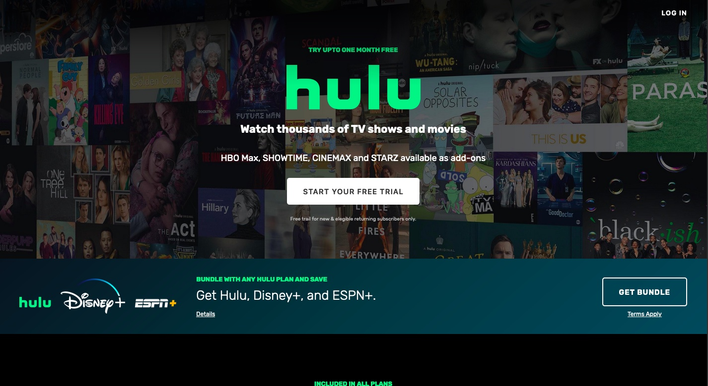
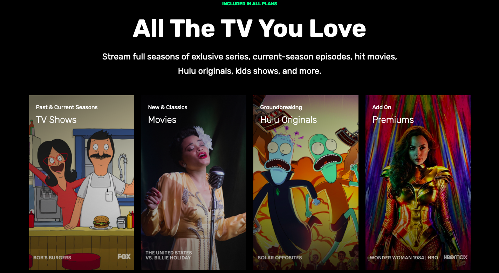
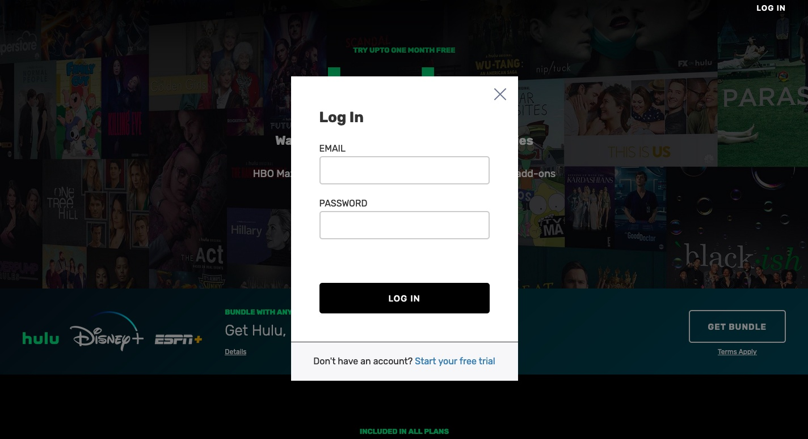

# Hulu Clone

In this project I have a clone of Hulu website using HTML, CSS and JS.

## Table of contents

- [Overview](#overview)
  - [Screenshot](#screenshot)
  - [Links](#links)
- [My process](#my-process)
  - [Built with](#built-with)
- [Author](#author)

## Overview

### Screenshot

### Links

- Live Site URL: [Hulu Clone](https://zoxabbasi.github.io/hulu_clone/)

## My process

- Using multiples HTML elements for styling purposess.
- Using CSS to style the page.
- Using AOS Javascript for the affects.

### Built with

- Semantic HTML5 markup.
- CSS.
- AOS Javascript.

## Author

- Website - [Talal Abbasi](https://zoxabbasi.github.io/)
- Twitter - [@zoxabbasi](https://www.twitter.com/zoxabbasi)
